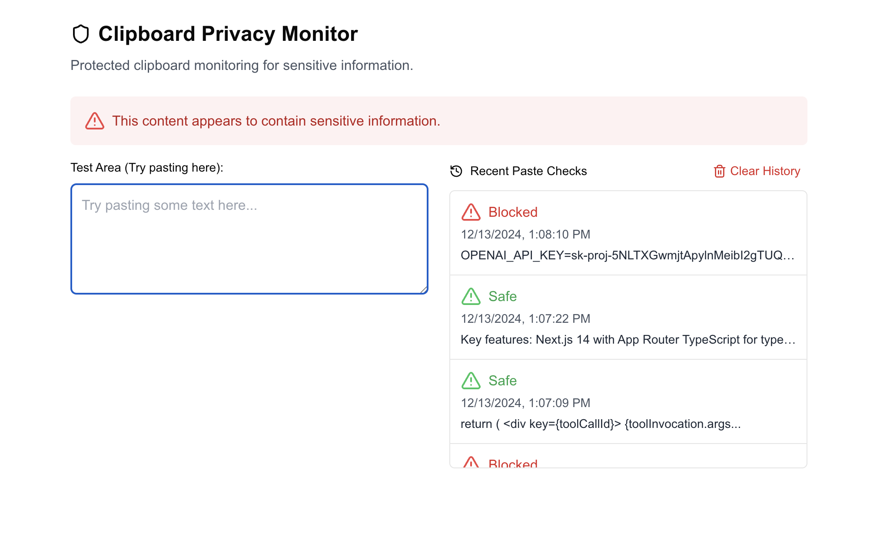

# Clipboard Privacy Monitor

A proof-of-concept application demonstrating an enterprise-grade clipboard monitoring system designed to prevent accidental leakage of sensitive company information.



## Overview

This project showcases a potential solution for organizations looking to protect sensitive data from being accidentally shared through copy-paste actions. While this demo uses a cloud-based LLM, the concept could be implemented using local models running directly on employee machines for enhanced privacy and security.

### Key Features

- Real-time clipboard content analysis
- Instant feedback on paste attempts
- Historical tracking of paste checks
- Visual indicators for safe/unsafe content
- Minimal UI interference for legitimate paste actions

### How It Works

1. User attempts to paste content into any application
2. The system intercepts the paste action
3. Content is analyzed for potential sensitive information
4. If safe, the paste proceeds normally
5. If sensitive information is detected, the paste is blocked and the user is notified

This proof of concept demonstrates the feasibility of a system-wide implementation that could:
- Run entirely locally using on-device ML models
- Integrate with enterprise security policies
- Provide audit logs for security teams
- Help prevent accidental data leaks

## Technical Implementation

The current implementation uses:
- Next.js for the web interface
- Prisma for paste history tracking
- LLM integration for content analysis
- SQLite for local storage
- TypeScript for type safety

While this demo runs as a web application, the same principles could be applied to create a system-wide service that monitors all clipboard activities across applications.

## Future Possibilities

- System-wide installation and monitoring
- Local LLM implementation for enhanced privacy
- Custom rule sets for different security levels
- Integration with DLP (Data Loss Prevention) systems
- Real-time reporting to security teams
- Custom allowed/blocked content patterns

## Getting Started

If you'd like to try out this proof of concept:

1. Clone the repository
```bash
git clone <repository-url>
cd clipboard-monitor
```

2. Install dependencies
```bash
npm install
```

3. Set up the database
```bash
npx prisma migrate dev
```

4. Create a `.env` file with your OpenAI credentials
```
AZURE_OPENAI_API_KEY=your-key-here
AZURE_OPENAI_ENDPOINT=your-endpoint-here
AZURE_OPENAI_DEPLOYMENT=your-deployment-here
```

5. Run the development server
```bash
npm run dev
```

Note: The OpenAI integration is just for demonstration purposes. In a production environment, this would be replaced with a local model running directly on the user's machine for enhanced privacy and security.